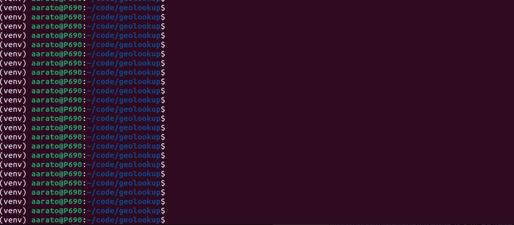

# Geolookup
Geolookup based on GeoLite2 Free Geolocation Data. Since the database is on the local drive the lookup is **much faster** and not rate limited like many alternatives found online.
You need to create a license.txt file with a free API key from the [GeoLite2](https://dev.maxmind.com/geoip/geolite2-free-geolocation-data) website.The script will download the up-to-date database from Maxmind automatically, if it is older than 24 hours.

## Demo



## Installation & Usage
Script will print out the geolocation of all IP addresses (1 per line) in the ips.txt file.

```
# dowload repository
git clone https://github.com/aarato/geolookup
cd geolookup
# Create and activate virtual environment
python3 -m venv venv
source venv/bin/activate # or .\venv\Scripts\activate on Windows
pip3 install -r requirements.txt
# Create license file with MaxMind API key without the quotes
echo "My_License_Key_From_Maxmind" > license.txt
# Update ips.txt files with 1 IP address per line and run the script
python3 index.py
```
